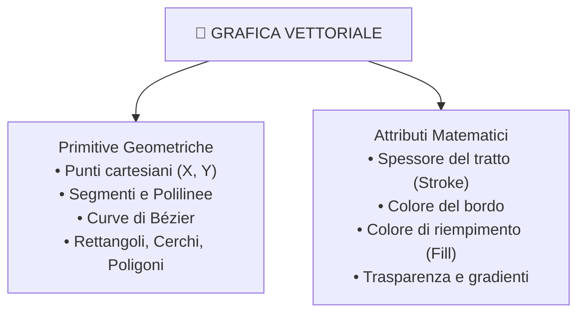
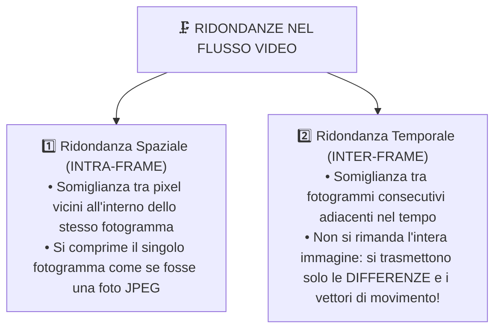
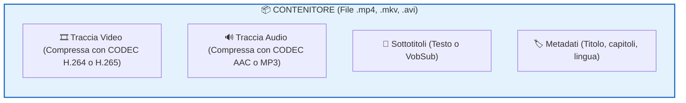

# 🎬 Grafica Vettoriale e Video Digitale

Mentre le immagini raster catturano la realtà suddividendola in una griglia statica di pixel, la grafica digitale comprende altri due pilastri evoluti: la **grafica vettoriale**, che descrive il mondo visivo attraverso equazioni matematiche perfette e scalabili, e il **video digitale**, che aggiunge la dimensione del **tempo** creando l'illusione del movimento continuo.

---

## 1. La Grafica Vettoriale

Un'immagine vettoriale non memorizza i singoli quadratini colorati, ma contiene una lista di **istruzioni ed equazioni geometriche** che il computer esegue per disegnare la figura.

![[vettoriale_vs_raster_volpe.png|750]]

### I Tre Enormi Vantaggi del Vettoriale

1. **Scalabilità Infinita (Zero Sgranatura)**:
   - Poiché le forme sono generate da formule matematiche ($x^2 + y^2 = r^2$), ingrandire l'immagine di 10 o 10.000 volte significa solo ricalcolare le coordinate con fattori di scala maggiori. I contorni rimarranno sempre **perfettamente lisci e affilati**, senza mai mostrare scalettature (*pixelation*).
2. **Peso del File Estremamente Contenuto**:
   - Memorizzare la formula di un cerchio richiede poche decine di Byte di testo, a prescindere dal fatto che il cerchio venga poi visualizzato su uno smartwatch da 1 pollice o stampato su un cartellone pubblicitario di 20 metri.
3. **Facilità di Modifica e Animazione**:
   - Ogni singolo oggetto (un testo, una stella, una linea) rimane un'entità indipendente: può essere spostato, colorato o ridimensionato in qualsiasi momento senza intaccare gli elementi sottostanti.

---

### Il Processo di Rasterizzazione

I monitor dei nostri computer, i display degli smartphone e le testine delle stampanti sono fisicamente composti da griglie di pixel reali. 

> [!IMPORTANT] Cos'è la Rasterizzazione?
> La **rasterizzazione** è il processo di calcolo mediante il quale il processore (o la scheda grafica GPU) **converte le istruzioni matematiche vettoriali nella matrice fisica di pixel** necessaria per la visualizzazione a schermo o per la stampa.
> 
> Durante la rasterizzazione si applicano tecniche di **Antialiasing** (sfumatura controllata dei bordi con tonalità intermedie) per evitare l'effetto scalettato (*aliasing*) sui contorni curvi o diagonali.

---

### I Formati di File Vettoriali Più Diffusi

![[tipologie_immagini_vettoriali.png|750]]

| Formato | Nome Completo | Tipo | Descrizione e Utilizzo |
| :--- | :--- | :---: | :--- |
| **SVG** | *Scalable Vector Graphics* | **Standard Aperto (W3C)** | Il re del web. Basato su linguaggio XML, è leggibile come codice sorgente, integrabile direttamente in HTML e CSS, e animabile via JavaScript. Ideale per loghi e icone. |
| **AI** | *Adobe Illustrator* | Proprietario | Lo standard industriale de-facto per la progettazione grafica vettoriale professionale e la grafica pubblicitaria. |
| **DXF / DWG** | *Drawing Exchange Format* | Tecnico / Industriale | Formati standard per il disegno tecnico assistito dal calcolatore (**CAD**) in ingegneria, architettura e macchine a controllo numerico (CNC). |
| **EPS** | *Encapsulated PostScript* | Professionale Stampa | Formato storico ideato da Adobe per l'interscambio di documenti grafici vettoriali destinati alla stampa tipografica ad alta risoluzione. |

---

## 2. Le Immagini in Movimento: Il Video Digitale

Un video digitale non è altro che una **successione rapidissima di immagini statiche (fotogrammi)** proiettate in sequenza temporale.

### Il Principio Fisiologico: La Persistenza Retinica
L'illusione del movimento continuo si basa sui limiti della fisiologia umana:
- La retina dell'occhio umano e il cervello trattengono ogni stimolo visivo per circa $\frac{1}{16}$ di secondo (fenomeno della *persistenza della visione* e *effetto Phi*).
- Se proiettiamo immagini statiche a una frequenza superiore a circa **16-20 immagini al secondo**, il cervello non percepisce più singoli scatti isolati, ma fonde la sequenza in un **movimento continuo e fluido**.

---

### Il Frame Rate (FPS)

> [!IMPORTANT] Definizione di Frame Rate
> Il **Frame Rate** è la frequenza con cui i fotogrammi (*Frame*) vengono catturati e riprodotti al secondo. Si misura in **FPS (*Frames Per Second*)** o Hertz (Hz).

| Valore FPS | Ambito di Utilizzo | Sensazione Visiva |
| :---: | :--- | :--- |
| **24 FPS** | **Cinema tradizionale su pellicola** | Il classico "look cinematografico" caldo, con naturale sfocatura da movimento (*motion blur*). |
| **25 FPS** | **Televisione europea (Standard PAL)** | Standard delle trasmissioni televisive in Europa. |
| **30 FPS** | **Televisione americana/asiatica (Standard NTSC)** | Standard televisivo e streaming video su web. |
| **60 FPS** | **Videogiochi, dirette sportive, smartphone** | Movimento fluidissimo e iper-reattivo, ideale per scene d'azione rapida. |
| **120 / 240 FPS** | **Gaming competitivo ed eSport / Slow Motion** | Massima reattività nei monitor da gioco, riprese rallentate ad altissima definizione. |

---

## 3. Calcolo del Peso di un Video NON Compresso

La quantità di dati generata da un flusso video digitale non compresso è mastodontica, perché moltiplica la dimensione spaziale di una foto per la dimensione temporale dei frame:

$$\mathbf{\text{Dimensione (bit)} = \text{Larghezza} \times \text{Altezza} \times \text{Profondità Colore (bit)} \times \text{FPS} \times \text{Durata (secondi)}}$$

$$\text{Dimensione (Byte)} = \frac{\text{Dimensione in bit}}{8}$$

---

### Esercizio Guidato (Dimostrazione Pratica)

> Calcolare il peso di appena **1 minuto** ($60 \text{ secondi}$) di filmato in risoluzione **Full HD** ($1920 \times 1080$), registrato a **60 FPS** con profondità **True Color** ($24 \text{ bit} = 3 \text{ Byte}$ per pixel), privo di compressione:
> 
> 1. Pixel per ogni singolo fotogramma:
>    $$1920 \times 1080 = 2.073.600 \text{ pixel}$$
> 2. Peso di un singolo fotogramma:
>    $$2.073.600 \times 3 \text{ Byte} = 6.220.800 \text{ Byte} \approx 5,93 \text{ MB per frame}$$
> 3. Numero totale di frame in 60 secondi a 60 fps:
>    $$60 \text{ fps} \times 60 \text{ secondi} = 3.600 \text{ fotogrammi}$$
> 4. Peso totale complessivo:
>    $$\text{Peso} = 6.220.800 \text{ Byte} \times 3.600 \approx 22.394.880.000 \text{ Byte}$$
>    $$\text{Peso in GigaByte (GB)} = \frac{22.394.880.000}{1024^3} \approx \mathbf{20,85 \text{ GB}!}$$

> [!WARNING] Conclusione Inevitabile
> Un solo minuto di video richiederebbe oltre **20 Gigabyte** di spazio! Un film da due ore richiederebbe più di **2 Terabyte** di memoria.
> Senza tecniche di compressione video avanzate, **Internet, YouTube, Netflix, le videochiamate e i social network non potrebbero fisicamente esistere**.

---

## 4. La Compressione Video: Ridondanza Spaziale e Temporale

La compressione video si basa sul fatto che tra un fotogramma e il successivo quasi tutto rimane identico:

### La Struttura GOP (Group of Pictures): I, P e B Frame
I moderni algoritmi di compressione video suddividono la sequenza di immagini in tre tipologie di frame:
- **I-Frame (*Intra-coded Frame*)**: è un fotogramma completo indipendente (come una foto JPEG integrale). Non dipende da nessun altro frame ed è il punto di riferimento (*Keyframe*).
- **P-Frame (*Predicted Frame*)**: memorizza unicamente le differenze e i vettori di spostamento rispetto al frame precedente. Pesa circa un terzo di un I-Frame.
- **B-Frame (*Bi-directional Frame*)**: è il più compatto in assoluto; calcola le differenze interpolando sia il frame che precede sia quello che segue!

---

## 5. Differenza Cruciale tra CODEC e CONTENITORE

Uno degli errori più comuni tra gli studenti è confondere il *formato del file* con il *codec video*:

> [!IMPORTANT] La Distinzione Fondamentale
> - **CODEC (*COder-DECoder*)**: è l'**algoritmo matematico** software o hardware che si occupa di comprimere il segnale durante la registrazione e decomprimerlo durante la riproduzione (è il *"motore"*).
> - **CONTENITORE (*Container*)**: è il **formato di file (la "scatola")** con una determinata estensione, progettato per contenere e sincronizzare al proprio interno il flusso video compresso, una o più tracce audio multicanale, sottotitoli e capitoli.

---

### I Principali Codec Video di Oggi

![[codec_video_diffusi.png|800]]

| Codec | Standard / Sviluppatore | Efficienza | Utilizzo Principale |
| :--- | :--- | :---: | :--- |
| **H.264 (AVC)** | ITU-T / ISO MPEG | Elevata | Lo standard più universale al mondo. Supportato da ogni browser, smartphone, televisore e Blu-ray. |
| **H.265 (HEVC)** | ITU-T / ISO MPEG | **Doppia rispetto ad H.264** | Dimezza la dimensione a parità di qualità. Indispensabile per lo streaming **4K HDR** e 8K. |
| **VP9** | Google (Open source) | Paragonabile ad H.265 | Il codec adottato nativamente da Google per la riproduzione su **YouTube**. |
| **AV1** | *Alliance for Open Media* (Google, Apple, Microsoft, Netflix, Amazon) | **Superiore ad H.265** | Il modernissimo codec aperto e royalty-free destinato a dominare il futuro dello streaming web. |
| **DivX / Xvid** | MPEG-4 Part 2 | Storica | Popolarissimo negli anni 2000 per comprimere film interi su singoli CD da 700 MB. |

---

### I Principali Contenitori (File Formats)

| Estensione | Nome | Caratteristiche |
| :---: | :--- | :--- |
| `.mp4` | **MPEG-4 Part 14** | Il contenitore più diffuso e compatibile al mondo per web, smartphone e streaming. |
| `.mkv` | **Matroska** | Contenitore open source estremamente flessibile: supporta tracce audio e sottotitoli multipli selezionabili. Molto amato per i film in alta definizione. |
| `.webm` | **WebM** | Contenitore basato su Matroska, ottimizzato per il tag `<video>` di HTML5 sul web. |
| `.mov` | **Apple QuickTime** | Formato standard sviluppato da Apple per l'ecosistema macOS e iOS. |
| `.avi` | **Audio Video Interleave** | Storico formato contenitore Windows introdotto da Microsoft nel 1992, privo di funzioni avanzate. |
