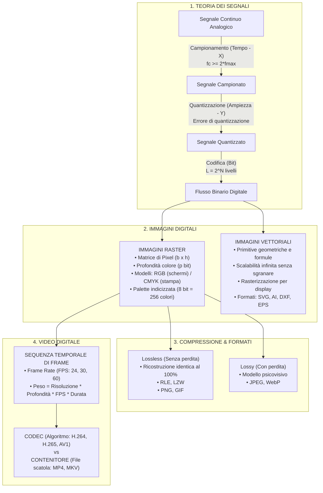

# 🎯 Sintesi, Formulario Rapido e Mappa Concettuale
Questa pagina raccoglie in un unico colpo d'occhio tutti i concetti chiave del modulo di **Digitalizzazione e Multimedialità**, fornendo un formulario immediato per il calcolo dei pesi e un glossario dei termini specialistici.

---
## 🗺️ Mappa Sinottica d'Insieme

---
## 📐 Formulario Rapido per le Verifiche Scritte

### 1. Frequenza di Campionamento e Teorema di Shannon
$$\mathbf{f_c \ge 2 \cdot f_{\max}} \qquad \left[ T_c = \frac{1}{f_c} \right]$$

### 2. Livelli di Quantizzazione e Numero di Bit
$$\mathbf{L = 2^N} \iff \mathbf{N = \lceil \log_2(L) \rceil}$$

### 3. Risoluzione, Definizione e Dimensioni di Stampa
$$\text{Dimensione in Pollici} = \frac{\text{Definizione in Pixel}}{\text{Risoluzione in PPI (o DPI)}}$$
$$\text{Dimensione in Centimetri (cm)} = \text{Dimensione in Pollici} \times 2,54$$

### 4. Peso di un'Immagine Raster NON Compressa (True Color o Grayscale)
$$\mathbf{\text{Peso (bit)} = \text{Larghezza} \times \text{Altezza} \times \text{Profondità di Colore (bit)}}$$
$$\mathbf{\text{Peso (Byte)} = \frac{\text{Larghezza} \times \text{Altezza} \times \text{Profondità}}{8}}$$
$$\text{Peso (KB)} = \frac{\text{Peso (Byte)}}{1024} \qquad \text{Peso (MB)} = \frac{\text{Peso (KB)}}{1024}$$

### 5. Peso di un'Immagine con Palette Indicizzata (es. GIF a 256 colori)
$$\mathbf{\text{Peso Totale (Byte)} = \left(\frac{b \times h \times p_{\text{indice}}}{8}\right) + (N_{\text{colori}} \times 3 \text{ Byte})}$$
*(Con $p_{\text{indice}} = 8 \text{ bit}$ e $N_{\text{colori}} = 256$, la palette aggiunge $768 \text{ Byte}$ fissi).*

### 6. Peso di un Video Digitale NON Compresso
$$\mathbf{\text{Dimensione (Byte)} = \frac{\text{Larghezza} \times \text{Altezza} \times \text{Profondità (bit)} \times \text{FPS} \times \text{Durata (secondi)}}{8}}$$

---
## 📖 Glossario delle Parole Chiave (Techwords)
- **Aliasing**: Distorsione ed effetto di scalettatura che si verifica quando la frequenza di campionamento è insufficiente ($f_c < 2 f_{\max}$) o quando una linea vettoriale viene rasterizzata senza antialiasing.
- **Antialiasing**: Tecnica che attenua i bordi seghettati dei pixel sfumandoli gradualmente con tonalità intermedie di colore verso lo sfondo.
- **Canale Alfa (Alpha Channel)**: Informazione accessoria a 8 bit associata a ciascun pixel che ne definisce il grado di trasparenza (da 0 = completamente trasparente a 255 = completamente opaco).
- **CLUT (Color Look-Up Table)**: Tavolozza o tavola di consultazione dei colori memorizzata all'interno di un file grafico indicizzato (es. GIF).
- **CMYK**: Modello di colore a sintesi sottrattiva basato sui quattro inchiostri primari Ciano, Magenta, Giallo e Nero (*Key*), indispensabile per la stampa tipografica.
- **CODEC**: Acronimo di *COder-DECoder*. È l'algoritmo matematico che comprime un flusso di dati audio/video in registrazione e lo decomprime in fase di riproduzione (es. H.264, HEVC, AV1).
- **Contenitore (Container)**: Formato file multimediale (es. `.mp4`, `.mkv`) che racchiude, sincronizza e organizza uno o più flussi compressi video, audio, sottotitoli e metadati.
- **DPI (Dots Per Inch)**: Punti di inchiostro per pollice lineare depositati su un supporto cartaceo da una stampante.
- **FPS (Frames Per Second)**: Numero di singoli fotogrammi proiettati ogni secondo in un video o videogioco.
- **GOP (Group of Pictures)**: Gruppo strutturato di fotogrammi video consecutivi composto da un I-Frame (chiave) seguito da P-Frame e B-Frame predittivi.
- **Lossless**: Tipo di compressione reversibile che preserva l'integrità totale dei dati originali bit per bit senza alcuna perdita di informazione.
- **Lossy**: Tipo di compressione irreversibile che rimuove le componenti del segnale considerate meno percepibili dall'occhio o dall'orecchio umano.
- **Pixel**: Contrazione di *Picture Element*. È il più piccolo elemento elementare e indivisibile che compone un'immagine digitale raster.
- **PPI (Pixels Per Inch)**: Numero di pixel fisici contenuti in un pollice lineare di display o monitor.
- **Rasterizzazione**: Conversione di un disegno vettoriale geometrico continuo in una griglia discreta di pixel visibili su uno schermo.
- **RGB**: Modello di colore a sintesi additiva basato sui tre colori primari della luce: Rosso (*Red*), Verde (*Green*) e Blu (*Blue*).
- **RLE (Run-Length Encoding)**: Algoritmo di compressione lossless che raggruppa sequenze ripetute di caratteri o colori identici memorizzando la coppia (ripetizioni, valore).
- **SVG (Scalable Vector Graphics)**: Formato grafico vettoriale aperto standardizzato dal W3C basato su XML.
- **True Color**: Modalità grafica a 24 bit per pixel (8 bit per ciascuno dei tre canali RGB), in grado di generare $16.777.216$ sfumature distinte di colore.
