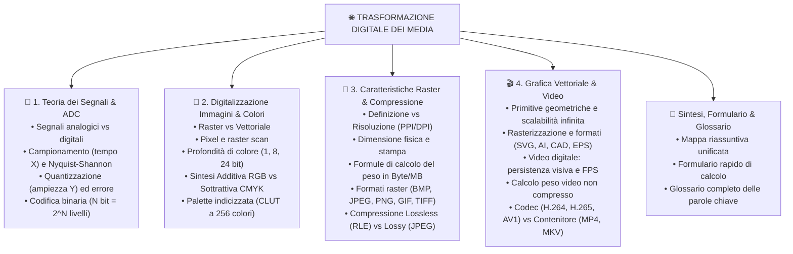

# 🌐 Digitalizzazione e Multimedialità (Segnali, Immagini e Video)

Benvenuto nel modulo dedicato alla **Rappresentazione Digitale dei Dati Multimediali**. In questo percorso didattico esploreremo come i segnali continui del mondo fisico (onde sonore, luce, scene reali) vengono trasformati in flussi binari numerici, come nascono e si memorizzano le immagini statiche e vettoriali, e come le tecnologie video moderne consentono lo streaming di filmati ad altissima definizione.

---

## 🗺️ Mappa Concettuale Generale del Percorso

---

## 📚 Indice Dettagliato delle Lezioni

1. [[1. Teoria dei Segnali e Conversione Analogico-Digitale|📡 Lezione 1: Teoria dei Segnali e Conversione Analogico-Digitale (ADC)]]
   - Natura dei segnali fisici: analogico vs discreto, continuo vs campionato.
   - I tre passi dell'ADC: **Campionamento** (asse X), **Quantizzazione** (asse Y), **Codifica** (bit).
   - Il Teorema di Nyquist-Shannon ($f_c \ge 2 f_{\max}$) e l'aliasing.
   - Calcolo combinatorio e livelli di quantizzazione ($L = 2^N$).

2. [[2. Digitalizzazione delle Immagini e Modelli di Colore|🎨 Lezione 2: Digitalizzazione delle Immagini e Modelli di Colore]]
   - Confronto strutturale tra immagini Raster (matrici di pixel) e Vettoriali (formule geometriche).
   - Fasi della digitalizzazione: campionamento spaziale, quantizzazione del colore e lettura raster.
   - Profondità di colore: immagini binarie, scala di grigi, True Color a 24 bit.
   - I modelli di colore: **RGB** per schermi luminosi e **CMYK** per la stampa su carta.
   - La tavolozza dei colori (**Palette Indicizzata**) per risparmiare memoria (formato GIF).

3. [[3. Caratteristiche Raster, Calcolo del Peso e Compressione|📐 Lezione 3: Caratteristiche Raster, Calcolo del Peso e Compressione]]
   - Definizione ($b \times h$ pixel) vs Risoluzione spaziale (PPI / DPI) vs Dimensione fisica di stampa.
   - Formule complete per il calcolo del peso in Byte e MegaByte (con e senza palette).
   - Panoramica comparativa dei formati file raster: BMP, JPEG, PNG, GIF, TIFF, RAW, WebP.
   - Tecniche di compressione dati: **Lossless** senza perdita (algoritmo RLE) vs **Lossy** con perdita (modello psicovisivo JPEG).

4. [[4. Grafica Vettoriale e Video Digitale|🎬 Lezione 4: Grafica Vettoriale e Video Digitale]]
   - Elementi della grafica vettoriale: primitive, equazioni e scalabilità infinita priva di sgranature.
   - Il processo di rasterizzazione e i formati standard (SVG per il web, AI, DXF/DWG per il CAD, EPS).
   - Il video digitale: persistenza retinica, Frame e Frame Rate (FPS).
   - Dimostrazione del peso enorme di un video non compresso.
   - Compressione video (ridondanza intra-frame e inter-frame: I, P, B frame).
   - Differenza cruciale tra **CODEC** (H.264, H.265/HEVC, VP9, AV1) e **CONTENITORE** (MP4, MKV, WebM, AVI).

5. [[Sintesi e Mappa Concettuale|🎯 Sintesi, Formulario Rapido e Mappa Concettuale]]
   - Tavola sinottica e formulario con tutte le equazioni per le verifiche.
   - Glossario completo di tutti i termini tecnici specialistici.
