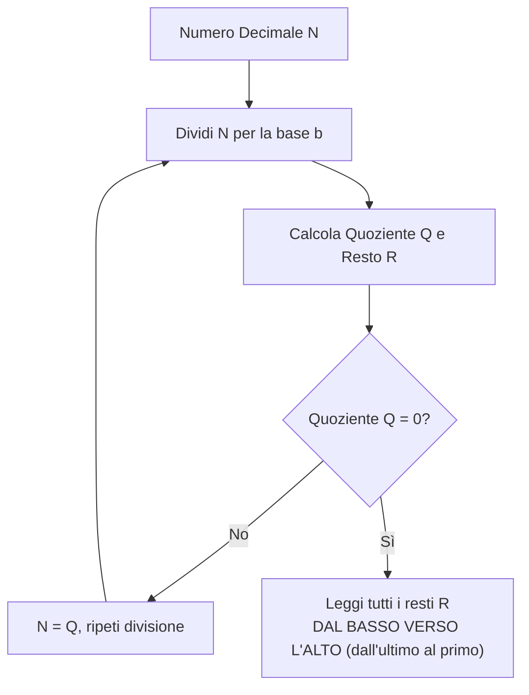
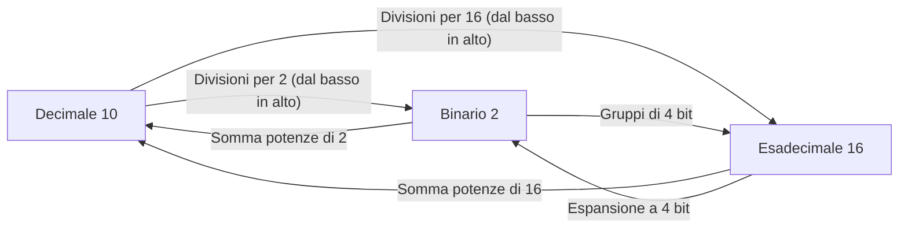

# 🔢 Sistemi di Numerazione e Conversioni di Base
Nel mondo dell'informatica, i calcolatori elettronici non utilizzano la base decimale (in uso dagli esseri umani) per via della loro natura fisica: i circuiti integrati funzionano grazie a transistor che possono assumere solo due stati stabili di tensione (spento o acceso, assenza o presenza di corrente). Da qui nasce la necessità di padroneggiare il **sistema binario** e i suoi stretti parenti: l'**esadecimale** e l'**ottale**.

---
## 1. La Notazione Posizionale e il Teorema Fondamentale
Tutti i sistemi numerici moderni che utilizziamo sono **posizionali**: il valore espresso da una determinata cifra dipende dalla **posizione** che essa occupa all'interno del numero.

In una base generica $b$, un numero $N$ formato dalle cifre $(c_{n-1} c_{n-2} \dots c_1 c_0 , c_{-1} c_{-2} \dots c_{-m})_b$ assume il valore decimale dato dal **Teorema Fondamentale della Numerazione Posizionale**:

$$N_{10} = \sum_{i=-m}^{n-1} c_i \cdot b^i = c_{n-1} \cdot b^{n-1} + \dots + c_1 \cdot b^1 + c_0 \cdot b^0 + c_{-1} \cdot b^{-1} + c_{-2} \cdot b^{-2} + \dots$$

### Le Basi più Importanti in Informatica
| Base | Nome | Simboli Utilizzati | Utilizzo Tipico |
| :--- | :--- | :--- | :--- |
| **Base 10** | **Decimale** | `0, 1, 2, 3, 4, 5, 6, 7, 8, 9` | Uso comune umano. |
| **Base 2** | **Binario** | `0, 1` | Linguaggio nativo delle CPU e dell'elettronica digitale. |
| **Base 16** | **Esadecimale** | `0, 1, ..., 9, A, B, C, D, E, F` | Indirizzi di memoria (RAM), codici colore web, MAC address. |
| **Base 8** | **Ottale** | `0, 1, 2, 3, 4, 5, 6, 7` | Permessi nei file system Linux/Unix (es. `chmod 755`). |

> [!NOTE] Corrispondenza delle cifre esadecimali
> Nel sistema esadecimale, non disponendo di singole cifre arabe per i valori da 10 a 15, si utilizzano le prime sei lettere dell'alfabeto:
> - **A** = $10$
> - **B** = $11$
> - **C** = $12$
> - **D** = $13$
> - **E** = $14$
> - **F** = $15$

---
## 2. Da Base Generica a Decimale (Sviluppo Polinomiale)
Per convertire un qualsiasi numero da una base $b$ a decimale, basta applicare direttamente il principio dei pesi posizionali.

### Da Binario a Decimale (Base 2 ➔ Base 10)
I pesi delle cifre da destra verso sinistra sono le potenze crescenti di 2:
$$2^0 = 1, \quad 2^1 = 2, \quad 2^2 = 4, \quad 2^3 = 8, \quad 2^4 = 16, \quad 2^5 = 32, \quad 2^6 = 64, \quad 2^7 = 128 \dots$$

> [!EXAMPLE] Esempio pratico (dal quaderno degli appunti)
> Convertire il numero binario $101011_2$ in decimale:
>
> $$101011_2 = (1 \cdot 2^5) + (0 \cdot 2^4) + (1 \cdot 2^3) + (0 \cdot 2^2) + (1 \cdot 2^1) + (1 \cdot 2^0)$$
> $$101011_2 = 32 + 0 + 8 + 0 + 2 + 1 = \mathbf{43_{10}}$$

---
### Da Esadecimale a Decimale (Base 16 ➔ Base 10)
I pesi sono le potenze di 16:
$$16^0 = 1, \quad 16^1 = 16, \quad 16^2 = 256, \quad 16^3 = 4096 \dots$$

> [!EXAMPLE] Esempio pratico (dal quaderno degli appunti)
> Convertire il valore esadecimale $01\text{CF}_{16}$ in decimale:
>
> Ricordiamo che $\text{C} = 12$ e $\text{F} = 15$:
> $$01\text{CF}_{16} = (0 \cdot 16^3) + (1 \cdot 16^2) + (12 \cdot 16^1) + (15 \cdot 16^0)$$
> $$01\text{CF}_{16} = 0 + 256 + 192 + 15 = \mathbf{463_{10}}$$

---
## 3. Da Decimale ad Altre Basi (Divisioni Successive)
Per convertire un numero intero decimale in una base $b$, si utilizza l'**algoritmo delle divisioni successive**:
1. Si divide il numero per la base $b$.
2. Si annota il quoziente intero e il **resto** ottenuto.
3. Si ripete la divisione del nuovo quoziente per $b$ fino a quando il quoziente non diventa **0**.
4. **Attenzione**: il numero convertito si ottiene leggendo i resti **dal basso verso l'alto** (l'ultimo resto ottenuto corrisponde alla cifra più significativa, **MSB** - *Most Significant Bit*).



### Esempio 1: Da Decimale a Binario (43 ➔ Base 2)
Dividiamo ripetutamente per 2:

| Divisione | Quoziente | Resto | Lettura |
| :---: | :---: | :---: | :---: |
| $43 : 2$ | $21$ | **1** | $\uparrow$ (LSB - cifra meno significativa) |
| $21 : 2$ | $10$ | **1** | $\uparrow$ |
| $10 : 2$ | $5$ | **0** | $\uparrow$ |
| $5 : 2$ | $2$ | **1** | $\uparrow$ |
| $2 : 2$ | $1$ | **0** | $\uparrow$ |
| $1 : 2$ | $0$ | **1** | $\uparrow$ (MSB - cifra più significativa) |

Leggendo i resti dal basso verso l'alto:
$$43_{10} = \mathbf{101011_2}$$

---
### Esempio 2: Da Decimale a Esadecimale (463 ➔ Base 16)
Dividiamo ripetutamente per 16:

| Divisione | Quoziente | Resto | Simbolo Esadecimale | Lettura |
| :---: | :---: | :---: | :---: | :---: |
| $463 : 16$ | $28$ | $15$ | **F** | $\uparrow$ (cifra meno significativa) |
| $28 : 16$ | $1$ | $12$ | **C** | $\uparrow$ |
| $1 : 16$ | $0$ | $1$ | **1** | $\uparrow$ (cifra più significativa) |

Leggendo i resti dal basso verso l'alto:
$$463_{10} = \mathbf{1CF_{16}}$$

---
## 4. Conversioni Rapide Dirette tra Binario, Esadecimale e Ottale
Poiché le basi 16 e 8 sono potenze esatte di 2 ($16 = 2^4$ e $8 = 2^3$), la conversione tra binario ed esadecimale (o ottale) **non richiede di passare per il decimale**!

### Tabella di Equivalenza Universale
| Decimale | Binario (4 bit) | Esadecimale | Ottale (3 bit) |
| :---: | :---: | :---: | :---: |
| **0** | `0000` | **0** | `000` (0) |
| **1** | `0001` | **1** | `001` (1) |
| **2** | `0010` | **2** | `010` (2) |
| **3** | `0011` | **3** | `011` (3) |
| **4** | `0100` | **4** | `100` (4) |
| **5** | `0101` | **5** | `101` (5) |
| **6** | `0110` | **6** | `110` (6) |
| **7** | `0111` | **7** | `111` (7) |
| **8** | `1000` | **8** | - |
| **9** | `1001` | **9** | - |
| **10** | `1010` | **A** | - |
| **11** | `1011` | **B** | - |
| **12** | `1100` | **C** | - |
| **13** | `1101` | **D** | - |
| **14** | `1110` | **E** | - |
| **15** | `1111` | **F** | - |

---
### Binario ➔ Esadecimale
1. Si raggruppano i bit a **quartetti (gruppi di 4 bit)** partendo da **destra verso sinistra**.
2. Se l'ultimo gruppo a sinistra non è completo, si aggiungono zeri in testa (*padding*).
3. Si traduce ciascun quartetto nella corrispondente cifra esadecimale.

> [!EXAMPLE] Esempio
> Convertire $11011011101_2$ in esadecimale:
> 1. Raggruppiamo: `110` | `1101` | `1101`
> 2. Aggiungiamo lo zero a sinistra: `0110` | `1101` | `1101`
> 3. Traduciamo:
>    - `0110` = $6$
>    - `1101` = $\text{D}$
>    - `1101` = $\text{D}$
>
> Risultato: $\mathbf{6DD_{16}}$

### Esadecimale ➔ Binario
Si sostituisce semplicemente ogni singola cifra esadecimale con il suo esatto quartetto di 4 bit binari:
- $\text{A7}_{16} \to \text{A} = 1010$, $7 = 0111 \implies \mathbf{10100111_2}$

---
## 5. Numeri Frazionari e Reali (con la Virgola)
Cosa succede quando abbiamo un numero non intero, come ad esempio $5,14$?
Il numero viene separato in due parti distinte:
1. **Parte Intera**: si converte con le consuete divisioni successive per 2.
2. **Parte Frazionaria**: si converte con l'algoritmo delle **moltiplicazioni successive per 2**.

### Algoritmo delle Moltiplicazioni Successive per la Parte Frazionaria
1. Si prende la sola parte decimale (es. $0,14$).
2. Si moltiplica per 2.
3. La **parte intera** del prodotto ($0$ oppure $1$) rappresenta la prima cifra binaria dopo la virgola.
4. Si prende la nuova parte frazionaria e si ripete la moltiplicazione per 2.
5. Il procedimento si arresta quando la parte decimale diventa $0$ (conversione esatta) oppure quando si raggiunge il numero desiderato di bit di precisione (approssimazione) o quando si individua un periodo.
6. **Attenzione**: le cifre binarie della parte frazionaria si leggono **DALL'ALTO VERSO IL BASSO**!

```
[PARTE FRAZIONARIA]  * 2  =  [INTERO].[NUOVA FRAZIONE]
                                |
                                v
                       Bit letto DALL'ALTO
```

---
### Esempio Pratico Guidato: Conversione di $5,14_{10}$ in Binario
> [!EXAMPLE] Dagli appunti del quaderno: $5,14_{10}$
>
> **Fase 1: Parte Intera ($5_{10}$)**
> - $5 : 2 = 2$ con resto **1**
> - $2 : 2 = 1$ con resto **0**
> - $1 : 2 = 0$ con resto **1**
> - Leggendo dal basso: $5_{10} = \mathbf{101_2}$
>
> **Fase 2: Parte Decimale ($0,14_{10}$)**
> Moltiplichiamo per 2 prendendo la parte intera:
>
> | Moltiplicazione | Risultato | Cifra Intera (Bit) | Lettura |
> | :---: | :---: | :---: | :---: |
> | $0,14 \cdot 2$ | $0,28$ | **0** | $\downarrow$ (primo bit dopo virgola) |
> | $0,28 \cdot 2$ | $0,56$ | **0** | $\downarrow$ |
> | $0,56 \cdot 2$ | $1,12$ | **1** | $\downarrow$ (si tiene $0,12$ per il passo successivo) |
> | $0,12 \cdot 2$ | $0,24$ | **0** | $\downarrow$ |
> | $0,24 \cdot 2$ | $0,48$ | **0** | $\downarrow$ |
> | $0,48 \cdot 2$ | $0,96$ | **0** | $\downarrow$ |
> | $0,96 \cdot 2$ | $1,92$ | **1** | $\downarrow$ |
>
> Leggendo le cifre dall'alto verso il basso:
> $$0,14_{10} \approx \mathbf{0,0010001\dots_2}$$
>
> Unendo parte intera e frazionaria:
> $$5,14_{10} \approx \mathbf{101,0010_2} \text{ (approssimato a 4 cifre frazionarie)}$$

---
### Da Binario con la Virgola a Decimale
Per tornare da un binario con la virgola al decimale, si usano le potenze negative di 2 per le cifre dopo la virgola:
- $2^{-1} = \frac{1}{2} = 0,5$
- $2^{-2} = \frac{1}{4} = 0,25$
- $2^{-3} = \frac{1}{8} = 0,125$
- $2^{-4} = \frac{1}{16} = 0,0625$

> [!EXAMPLE] Verifica inversa di $101,0010_2$:
> $$101,0010_2 = (1 \cdot 2^2) + (0 \cdot 2^1) + (1 \cdot 2^0) + (0 \cdot 2^{-1}) + (0 \cdot 2^{-2}) + (1 \cdot 2^{-3}) + (0 \cdot 2^{-4})$$
> $$= 4 + 0 + 1 + 0 + 0 + 0,125 + 0 = \mathbf{5,125_{10}}$$
> *(La differenza rispetto a 5,14 è dovuta al troncamento a 4 bit; aumentando i bit l'approssimazione diventa sempre più accurata).*

---
## 🎯 Scheda Riassuntiva Finale

