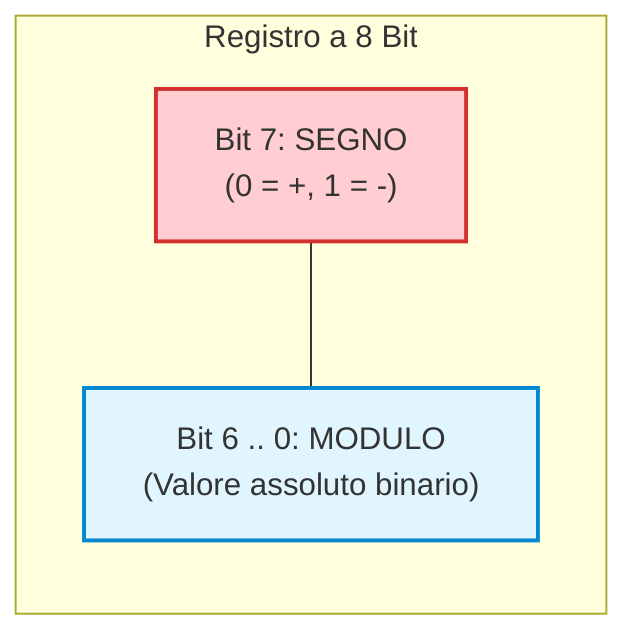

# 🛡️ Numeri con Segno e Complemento a 2

All'interno di un computer non possiamo inserire il carattere grafico `+` o `-` per indicare se un numero è positivo o negativo: la memoria fisica è composta esclusivamente da celle binarie che possono contenere solo `0` o `1`. 

Per memorizzare ed elaborare i numeri interi relativi ($\mathbb{Z}$) occorre quindi adottare una **convenzione di codifica**. Nel corso della storia dell'informatica sono stati ideati tre metodi principali, fino ad arrivare allo standard universale adottato oggi da ogni microprocessore: il **Complemento a 2**.

---

## 1. Modulo e Segno (MSB come Bit di Segno)

Il metodo più intuitivo consiste nel dedicare il bit più significativo (**MSB** - *Most Significant Bit*, il primo a sinistra) all'indicazione del segno:
- `0` indica segno **positivo (+)**
- `1` indica segno **negativo (-)**
- I restanti $N-1$ bit indicano il **valore assoluto (modulo)** del numero.



> [!EXAMPLE] Esempio su 8 bit:
> - $+5_{10} = \mathbf{0}0000101_2$
> - $-5_{10} = \mathbf{1}0000101_2$

### I Due Gravi Difetti del Modulo e Segno:
1. **Presenza del "Doppio Zero"**:
   - `00000000` = $+0$
   - `10000000` = $-0$
   Questo spreca una configurazione e costringe i circuiti logici a raddoppiare i controlli di uguaglianza per verificare se un valore è nullo.
2. **Circuiti aritmetici complessi**: non è possibile sommare direttamente due numeri in modulo e segno con un semplice sommatore elettronico (es. $(+5) + (-5) = 00000101 + 10000101 = 10001010 = -10$, risultato palesemente errato!).

---

## 2. Complemento a 1 (C1)

Nel **Complemento a 1**, i numeri positivi mantengono la normale rappresentazione binaria con `0` all'MSB. 
Per ottenere il corrispondente numero negativo, si applica l'operatore logico **NOT**: **si invertono semplicemente tutti i bit** (ogni `0` diventa `1` e ogni `1` diventa `0`).

Matematicamente, per un registro a $N$ bit, equivale a sottrarre il valore da una maschera di tutti `1` ($2^N - 1$).

> [!EXAMPLE] Esempio pratico (dal quaderno degli appunti)
> Rappresentare $+90$ e $-90$ su 8 bit in Complemento a 1:
> 
> 1. Scriviamo $+90_{10}$ in binario a 8 bit:
>    $$90_{10} = \mathbf{01011010_2}$$
> 
> 2. Calcoliamo $-90$ sottraendo da $11111111_2$ (oppure invertendo ogni bit):
>    ```
>        1 1 1 1 1 1 1 1 -
>        0 1 0 1 1 0 1 0 =   (+90)
>      -----------------
>        1 0 1 0 0 1 0 1     (-90 in C1)
>    ```

### Limite del Complemento a 1:
Anche il Complemento a 1 soffre del difetto del **doppio zero**:
- `00000000` = $+0$
- `11111111` = $-0$

---

## 3. Complemento a 2 (C2): La Soluzione Perfetta

Il **Complemento a 2** risolve brillantemente ogni problema ed è il sistema utilizzato in tutte le architetture moderne (x86, ARM, RISC-V).

### Regola Fondamentale di Calcolo
Per trovare l'opposto di un numero in Complemento a 2:
$$\mathbf{C2(X) = C1(X) + 1}$$

> [!IMPORTANT] In parole semplici
> 1. **Inverti tutti i bit** del numero (scambia gli `0` con gli `1`).
> 2. **Aggiungi 1** al risultato (somma binaria con eventuale propagazione del riporto).

---

### Esempio 1: Calcolo di $-90$ su 8 bit (dal quaderno degli appunti)

1. Valore positivo: $+90_{10} = \mathbf{01011010_2}$
2. Complemento a 1 (invertiamo i bit): $\mathbf{10100101_2}$
3. Aggiungiamo 1:
   ```
       1 0 1 0 0 1 0 1 +
                     1 =
     -----------------
       1 0 1 0 0 1 1 0
   ```
4. Risultato: $-90_{10}$ in Complemento a 2 su 8 bit è $\mathbf{10100110_2}$.

---

### ⚡ Metodo Rapido (Scorciatoia Visiva)
Esiste un trucco pratico immediato per fare il Complemento a 2 senza calcolare somme a parte:
1. Parti da **destra verso sinistra**.
2. **Copia inalterati tutti i bit** fino a quando incontri il **primo `1` compreso**.
3. Da quel punto in poi verso sinistra, **inverti tutti i restanti bit**.

Verifica su $+90$:
```
  Valore:       0  1  0  1  0  [0  1  0]   (il primo '1' da destra è al bit 1)
                                      ^
  Copia:                       [0  1  0]   (invariati fino al primo '1')
  Inverti:      1  0  1  0  0
  Risultato:    1  0  1  0  0   0  1  0  -> 10100110_2 (Identico!)
```

---

## 4. Il Peso del Bit di Segno in C2

Un modo straordinario e profondo per comprendere il Complemento a 2 è osservare i **pesi posizionali**.
In un numero a $N$ bit in C2, **tutti i bit mantengono i loro consueti pesi positivi tranne il bit più significativo (MSB), che assume peso NEGATIVO**:

$$\text{Peso dell'MSB} = \mathbf{-2^{N-1}}$$

Su un byte (8 bit):
| Bit 7 (MSB) | Bit 6 | Bit 5 | Bit 4 | Bit 3 | Bit 2 | Bit 1 | Bit 0 (LSB) |
| :---: | :---: | :---: | :---: | :---: | :---: | :---: | :---: |
| **$-128$** | $+64$ | $+32$ | $+16$ | $+8$ | $+4$ | $+2$ | $+1$ |

> [!EXAMPLE] Verifica del valore $-90 = 10100110_2$:
> $$\text{Valore} = (-128 \cdot 1) + (64 \cdot 0) + (32 \cdot 1) + (16 \cdot 0) + (8 \cdot 0) + (4 \cdot 1) + (2 \cdot 1) + (1 \cdot 0)$$
> $$\text{Valore} = -128 + 32 + 4 + 2 = -128 + 38 = \mathbf{-90_{10}}!$$
> La formula funziona con assoluta precisione matematica!

---

## 5. Come Funziona la Sottrazione con C2: $A - B = A + (-B)$

Il vantaggio epocale del Complemento a 2 è che **elimina la necessità di costruire circuiti sottrattori**: la sottrazione viene eseguita come una normale somma!

$$A - B = A + \text{C2}(B)$$

> [!IMPORTANT] Regola del Riporto Finale (Carry-Out)
> Quando eseguiamo una sottrazione trasformata in addizione in C2, se si genera un **riporto uscente oltre la dimensione del registro (MSB)**, questo riporto va **ignorato e scartato**!

---

### Esempio Guidato: Calcolo di $5 - 3$ (dal quaderno degli appunti)

Lavoriamo su **4 bit** (i numeri rappresentabili vanno da $-8$ a $+7$):
- $A = +5_{10} = \mathbf{0101_2}$
- $B = +3_{10} = \mathbf{0011_2}$

**Passo 1: Calcoliamo il complemento a 2 di $B$ (cioè $-3$)**
- Invertiamo i bit di `0011`: `1100`
- Aggiungiamo 1: `1100 + 1 = 1101_2` ($-3_{10}$)

**Passo 2: Eseguiamo la somma $5 + (-3)$**
```
      ¹ ¹ ¹         <- Riporti
        0 1 0 1 +   (+5)
        1 1 0 1 =   (-3 in C2)
      ---------
    (1) 0 0 1 0     (+2)
     ^
     |--- Riporto finale (Carry-out): SI ELIMINA!
```

Scartando il riporto finale di overflow sulla quinta posizione, il risultato rimasto nel registro a 4 bit è:
$$\mathbf{0010_2} = \mathbf{+2_{10}}$$
Il calcolo $5 - 3 = 2$ è esatto!

---

## 6. Intervallo di Rappresentabilità e il Fenomeno dell'Overflow

Con un registro di $N$ bit in Complemento a 2:
- Esiste **un solo zero**: $0000\dots0 = 0$.
- I numeri positivi vanno da $0$ a $2^{N-1} - 1$.
- I numeri negativi vanno da $-1$ a $-2^{N-1}$.

$$\text{Range C2}: \mathbf{[-2^{N-1}, \quad +2^{N-1} - 1]}$$

| Numero di Bit ($N$) | Valore Minimo (Negativo) | Valore Massimo (Positivo) |
| :---: | :---: | :---: |
| **4 bit** | $-2^3 = \mathbf{-8}$ | $+2^3 - 1 = \mathbf{+7}$ |
| **8 bit (Byte)** | $-2^7 = \mathbf{-128}$ | $+2^7 - 1 = \mathbf{+127}$ |
| **16 bit (Short)** | $-2^{15} = \mathbf{-32.768}$ | $+2^{15} - 1 = \mathbf{+32.767}$ |
| **32 bit (Int)** | $-2^{31} \approx \mathbf{-2,14 \cdot 10^9}$ | $+2^{31} - 1 \approx \mathbf{+2,14 \cdot 10^9}$ |

---

### Che cos'è l'Overflow (Trabocco)?

L'**overflow** si verifica quando il risultato di un'operazione aritmetica **eccede l'intervallo rappresentabile** con il numero di bit a disposizione.

> [!WARNING] Come riconoscere l'Overflow?
> L'overflow può avvenire **soltanto** quando si sommano due numeri con lo **stesso segno** (entrambi positivi o entrambi negativi):
> 1. **Positivo + Positivo = Negativo** $\implies$ **OVERFLOW!** (es. su 8 bit: $+100 + +50 = +150$, ma il massimo è $+127$; il risultato diventa erroneamente un numero negativo).
> 2. **Negativo + Negativo = Positivo** $\implies$ **OVERFLOW!**
> 
> *Nei circuiti delle CPU, la condizione di overflow viene segnalata impostando l'apposito flag hardware $V$ (Overflow Flag) nel registro di stato.*
