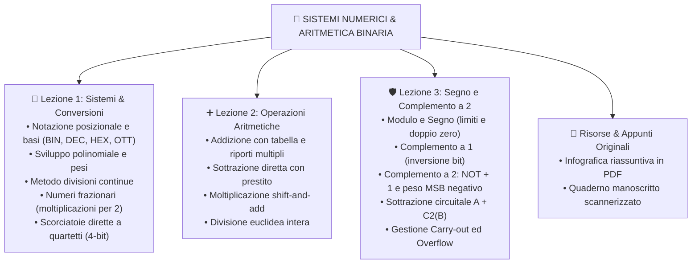

# 🔢 Operazioni coi Binari e Conversioni

Benvenuto nel modulo dedicato all'**Aritmetica Binaria e ai Sistemi di Numerazione**. Questa sezione raccoglie le basi teoriche, gli algoritmi pratici e gli esercizi guidati necessari per comprendere come i calcolatori memorizzano ed elaborano numeri ed operazioni matematiche elementari.

---

## 🗺️ Mappa Concettuale del Modulo

---

## 📚 Indice delle Lezioni

1. [[1. Sistemi di numerazione e Conversioni di base|📘 Lezione 1: Sistemi di Numerazione e Conversioni di Base]]
   - Notazione posizionale e basi numeriche fondamentali ($2, 8, 10, 16$).
   - Conversione da base qualsiasi a decimale mediante sviluppo polinomiale.
   - Conversione da decimale a binario/esadecimale mediante divisioni successive.
   - Conversioni rapide dirette tra Binario ed Esadecimale (raggruppamento a 4 bit).
   - Conversione di numeri reali e frazionari (metodo delle moltiplicazioni continue per 2).

2. [[2. Operazioni aritmetiche binarie|➕ Lezione 2: Operazioni Aritmetiche Binarie]]
   - Addizione binaria: regole di base, riporto (*carry*) e somme a tre operandi.
   - Sottrazione binaria diretta: regole e gestione del prestito (*borrow*).
   - Moltiplicazione binaria: logica *shift-and-add*.
   - Divisione binaria tra interi con quoziente e resto.

3. [[3. Rappresentazione dei numeri con segno e Complemento a 2|🛡️ Lezione 3: Numeri con Segno e Complemento a 2]]
   - Limiti del metodo in Modulo e Segno e del Complemento a 1.
   - Algoritmo pratico di calcolo del Complemento a 2 ($\text{C2} = \text{NOT} + 1$).
   - Interpretazione algebrica del peso negativo sul bit di segno (MSB).
   - Trasformazione circuitale della sottrazione in addizione ($A - B = A + \text{C2}(B)$).
   - Condizioni di Overflow (trabocco) e scarto del riporto finale.

---

## 📎 Risorse Collegate

- 📄 **[[InfograficaConversioni_e_OperazioniBinarie.pdf|Infografica Riassuntiva Conversioni e Operazioni (PDF)]]**
- 📝 **Tavola manoscritta originale di studio**:
  ![[appunti_originali_conversioni.png|650]]
