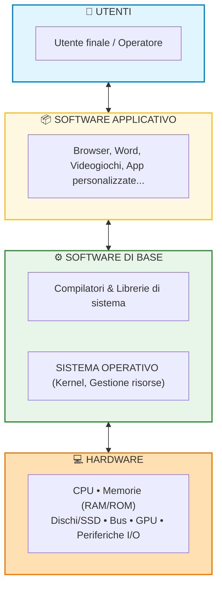
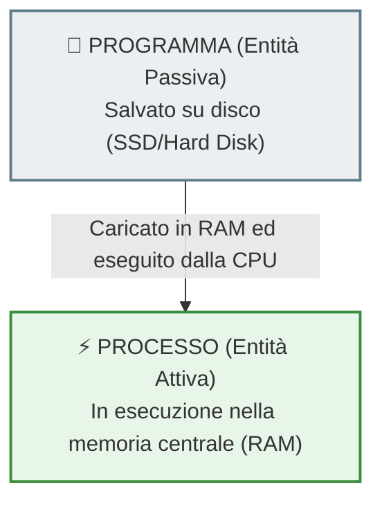
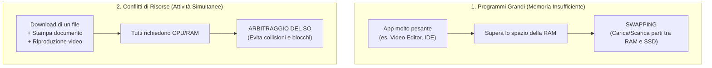

## 1. Che cos'è il Sistema Operativo (SO)?

Un computer, senza software, è semplicemente un insieme inerte di componenti elettronici e meccanici (chip di silicio, cavi, circuiti, ventole). 

Il **Sistema Operativo (SO)** è il **software di base** fondamentale che fa da **intermediario** (o strato *"cuscinetto"*) tra:
1. L'**utente** e i suoi programmi (**software applicativo**).
2. La parte fisica della macchina (**hardware**).

### Distinzione fondamentale del Software

| Tipologia | Definizione | Esempi |
| :--- | :--- | :--- |
| **Software di base** | Insieme di programmi **indispensabili** per far funzionare l'hardware e permettere l'esecuzione di qualsiasi altro programma. | Sistemi operativi (Windows, Linux, macOS, Android), compilatori, interpreti, driver e librerie di sistema. |
| **Software applicativo** | Programmi creati per risolvere specifici problemi dell'utente o svolgere compiti particolari. | Fogli di calcolo (Excel), browser web (Chrome), videogiochi, elaboratori di testo (Word). |

> [!IMPORTANT] Regola d'oro
> L'assenza del sistema operativo rende **totalmente inutilizzabile** qualsiasi computer, server, smartphone o tablet!

---

## 2. Il Principio di Astrazione e la Macchina Astratta

Grazie al sistema operativo, l'utente e i programmatori **non hanno bisogno di conoscere l'architettura interna** del dispositivo.

Ad esempio:
- Non devi sapere se i dati sono scritti su un hard disk magnetico SATA, su un velocissimo SSD NVMe o su una pennetta USB.
- Non devi sapere se la stampante collegata è laser o a getto d'inchiostro, o come dialogano i suoi transistor.
- Non devi conoscere le specifiche elettriche della scheda di rete o quanti nanometri misurano i transistor della CPU.

Il sistema operativo nasconde tutti questi dettagli tecnici complessi e presenta una **macchina astratta** (o virtuale):
- **Macchina Fisica**: complessa, varia per ogni computer, richiede di gestire segnali elettrici, registri hardware, temporizzazioni e indirizzi esadecimali.
- **Macchina Astratta**: un modello uniforme, pulito e intuitivo, dotato di tutte le risorse necessarie pronte all'uso.

### 🚗 Le Due Metafore Efficaci

> [!EXAMPLE] La Metafora dell'Automobile
> Per guidare un'auto non hai bisogno di sapere come funzionano i pistoni, le valvole a camme o l'impianto di iniezione elettronica. Ti basta conoscere l'**interfaccia comandi**: volante, pedali e cambio. 
> Il sistema operativo è la "plancia di comando" del computer: offre comandi standardizzati e gestisce lui tutta la "meccanica" interna.

> [!EXAMPLE] La Metafora del Maggiordomo
> Il sistema operativo si comporta come un **bravo maggiordomo**, sempre pronto a rispondere alle nostre richieste: noi diciamo cosa vogliamo fare (es. *"apri questa pagina"* o *"stampa questo documento"*) e lui attiva silenziosamente le risorse hardware adeguate per compiere l'azione, senza costringerci a scendere in cantina a muovere le valvole!

---

## 3. I Due Obiettivi Primari del Sistema Operativo

Un sistema operativo deve perseguire due scopi essenziali:

1. **Facilità d'uso (Efficacia / Trasparenza)**:
   - Permettere a qualunque utilizzatore (anche non esperto) di sfruttare le risorse hardware e software in modo immediato, trasparente e naturale.
2. **Ottimizzazione delle risorse (Efficienza / Politiche di Gestione)**:
   - Gestire e ripartire le risorse fisiche (che sono **limitate e contese**) tra le diverse applicazioni in esecuzione, evitando sprechi, rallentamenti o blocchi di sistema.

---

## 4. La Gestione delle Attività: Processi e Multitasking

### Che cos'è un Processo?

Spesso usiamo le parole *programma* e *processo* come sinonimi, ma in informatica c'è una netta differenza:

| Caratteristica | Programma | Processo |
| :--- | :--- | :--- |
| **Natura** | Entità **passiva** | Entità **attiva** |
| **Dove si trova?** | Memoria secondaria (SSD / Hard Disk) | Memoria centrale (RAM) |
| **Cosa fa?** | Codice e istruzioni salvate su file | Istruzioni in esecuzione da parte della CPU |

> [!IMPORTANT] Definizione Formale
> **Ogni applicazione (programma) in esecuzione su una macchina prende il nome di PROCESSO.**

### Che cos'è il Multitasking?

I moderni sistemi operativi sono **multitasking**: consentono l'esecuzione contemporanea (o con alternanza così rapida da sembrare simultanea) di più programmi.

In un sistema multitasking, molte applicazioni competono contemporaneamente per le stesse risorse hardware. Le risorse più contese sono:
- **CPU**: per eseguire il calcolo delle istruzioni.
- **RAM**: per conservare codice e dati attivi.
- **Memoria di massa (SSD / HDD)**: per caricare o salvare file.
- **Scheda di rete (Wi-Fi / Ethernet)**: per scambiare pacchetti su Internet.
- **GPU (Graphics Processing Unit)**: circuito elettronico dedicato alla grafica digitale, al rendering 3D, all'elaborazione video e alle animazioni.

---

## 5. Due Situazioni Critiche Gestite dal SO

Il sistema operativo interviene continuamente con le sue **politiche di gestione** razionale per risolvere due problemi critici:

1. **Esecuzione di programmi pesanti (Tecnica di Swapping)**:
   - Se un software applicativo ha dimensioni superiori alla RAM disponibile (ad esempio un software di grafica o modellazione 3D), il SO non va in blocco: carica in RAM solo le porzioni di programma che servono in quel momento e scarica su disco quelle inutilizzate. Questo continuo scambio tra RAM e memoria secondaria si chiama **swapping**.
2. **Concorrenza di più attività (Prevenzione dei conflitti)**:
   - Se stiamo ascoltando musica, scaricando un file e stampando contemporaneamente, tutti questi processi chiedono l'uso della CPU e della memoria. Il SO coordina i turni e le priorità per far sì che nessuno si blocchi e non ci siano conflitti di accesso alle medesime risorse.

---

## 6. Monitoraggio Reale: La Gestione Attività (Task Manager)

Nei sistemi Windows, lo strumento fondamentale per osservare l'operato del sistema operativo è il pannello **Gestione attività** (*Task Manager*, apribile con `Ctrl + Shift + Esc`):

- **Scheda Processi**: mostra la lista di tutte le applicazioni e dei processi in background, indicando per ciascuno la percentuale di CPU, RAM, Disco, Rete e GPU consumata in tempo reale.
- **Scheda Prestazioni**: mostra grafici dinamici sullo stato di carico complessivo dell'hardware (frequenza CPU, memoria occupata/disponibile, velocità di lettura/scrittura su disco, traffico Wi-Fi e carico GPU).

