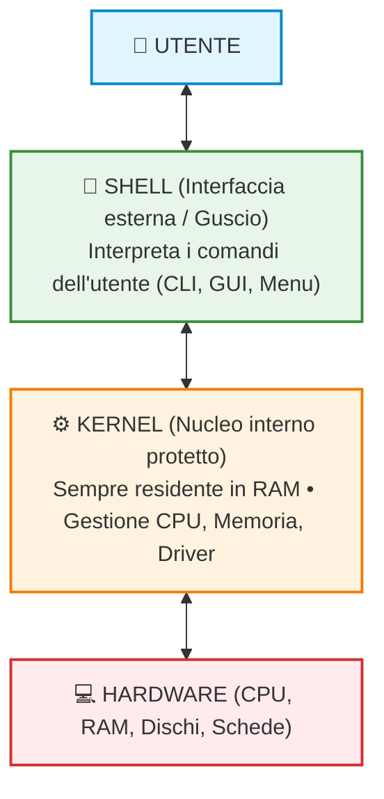
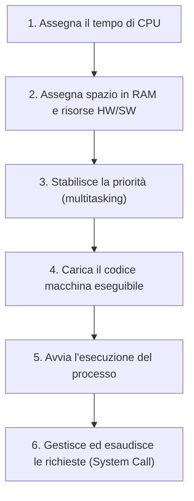
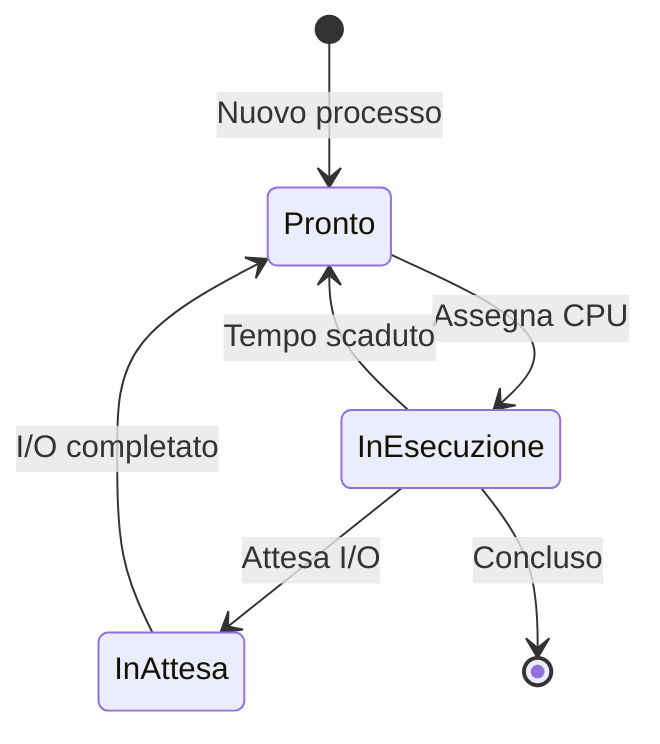
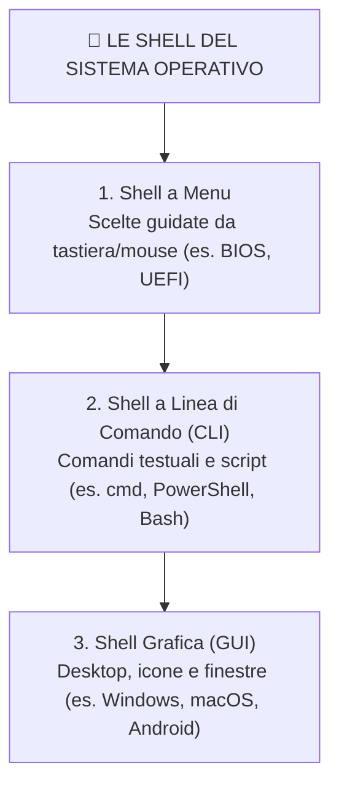

## 1. Visione d'Insieme: Nucleo e Guscio

Un sistema operativo può essere idealmente suddiviso in due grandi sezioni complementari:

---

## 2. Il Nucleo del Sistema Operativo: Il Kernel

Il **Kernel** (in tedesco *"nocciolo"* o *"seme"*) è la parte centrale e più importante del sistema operativo. È il ponte diretto tra i componenti hardware e i programmi in esecuzione.

### Perché il Kernel risiede sempre in RAM?

Un sistema operativo moderno è un software gigantesco (molti gigabyte di file su disco). Se venisse caricato tutto interamente nella memoria RAM:
- Occuperebbe quasi tutta la memoria disponibile;
- Non lascerebbe spazio sufficiente ai programmi applicativi dell'utente.

Per questa ragione:
1. I moduli secondari del SO risiedono su memoria secondaria (SSD/disco) e vengono caricati in RAM **solo quando servono**.
2. **Solo il Kernel è sempre residente in memoria centrale (RAM)**: viene caricato durante la fase di accensione (**bootstrap**) e **non viene mai scaricato**, né spostato su disco (divieto assoluto di *swapping*), perché senza di esso l'elaboratore cesserebbe istantaneamente di funzionare.

> [!IMPORTANT] Il Bootstrap
> Il **bootstrap** è la sequenza di avvio del computer: all'accensione della macchina, il firmware (BIOS/UEFI) individua l'unità di memoria secondaria di avvio e carica il kernel del sistema operativo nella memoria centrale (RAM), avviando il sistema.

---

### I 6 Compiti del Kernel per ogni Processo

Quando lanciamo un'applicazione, il kernel crea un **processo** ed esegue sei operazioni fondamentali:

1. **Assegna il tempo di CPU**: decide quanto tempo di calcolo concedere al processo.
2. **Assegna lo spazio di memoria**: riserva l'area di RAM necessaria per dati e istruzioni.
3. **Stabilisce la priorità**: determina l'importanza del processo rispetto agli altri processi attivi nel sistema.
4. **Carica il codice macchina**: trasferisce il file eseguibile da disco/SSD alla memoria centrale.
5. **Avvia l'esecuzione**: passa il controllo del Program Counter della CPU alla prima istruzione.
6. **Interagisce con le richieste**: risponde a tutte le chiamate di servizio avanzate dal processo mentre è in esecuzione (es. richiesta di leggere un file o connettersi a Internet).

---

### Gestione della Memoria e Virtualizzazione

Il kernel è responsabile di garantire che **nessun processo interferisca con la memoria usata da un altro processo** (protezione e isolamento reciproco).
- Applica tecniche di **virtualizzazione della memoria**, facendo credere a ciascuna applicazione di avere a disposizione un banco di memoria continuo e riservato.
- Decide in ogni istante quanta memoria concedere a ciascun processo e può assegnare porzioni di memoria condivisa quando più processi devono scambiarsi informazioni.

---

### Lo Scheduler (Schedulatore)

In un sistema multitasking, la CPU deve dividere la sua attenzione tra decine o centinaia di processi attivi. Il componente del kernel incaricato di questo compito è lo **Scheduler**:

- **Scandisce i tempi di esecuzione** assegnando la CPU a rotazione (*time slice*).
- **Gestisce lo stato dei processi**:
  - `Ready` (Pronto): il processo è pronto in coda e attende che la CPU si liberi.
  - `Running` (In esecuzione): il processo sta usando la CPU in questo preciso istante.
  - `Waiting / Blocked` (In attesa): il processo è fermo in attesa di un evento esterno (es. dati da disco, pressione di un tasto, risposta dalla rete).

> [!TIP] Perché lo Scheduler è geniale?
> La lettura dei dati da un SSD o da un hard disk è infinitamente più lenta della velocità della CPU. Se la CPU dovesse "aspettare senza far nulla" ogni volta che un programma carica un file, il computer sembrerebbe congelato.
> Lo **scheduler** sospende il processo in attesa e assegna immediatamente la CPU a un altro processo pronto: in questo modo la CPU lavora sempre al massimo dell'efficienza!

---

### Riepilogo dei Compiti Complessivi del Kernel

1. **Gestione della CPU**: scheduling e alternanza dei processi pronti per l'elaborazione.
2. **Gestione delle interruzioni (Interrupt)**: gestione tempestiva dei segnali di allarme o di richiesta prioritari inviati dall'hardware o dal software.
3. **Gestione della memoria**: allocazione dello spazio di RAM per ogni programma.
4. **Controllo dell'hardware tramite i Driver**: utilizzo di moduli software specifici (**driver**) per dialogare correttamente con ogni singola periferica.
5. **Controllo del ciclo di vita dei processi**: monitoraggio dello stato di avanzamento (*ready, running, waiting, terminated*).
6. **Sincronizzazione e comunicazione (IPC)**: meccanismi di scambio dati ordinato e sicuro tra processi cooperanti.

---

## 3. Il Guscio del Sistema Operativo: La Shell

Se il kernel è il nucleo interno protetto, la **Shell** (in inglese *"guscio"* o *"conchiglia"*) è l'**involucro esterno**: è l'**interfaccia** mediante la quale l'utente può dialogare e operare sul sistema.

La shell opera come un **interprete dei comandi**:
1. Rimane in attesa di un'istruzione digitata o cliccata dall'utente.
2. Esegue il **parsing** del comando.
3. Se il comando è corretto, ordina al kernel di eseguirlo.

> [!NOTE] Techwords: Che cos'è il Parsing?
> Il **parsing** (o analisi sintattica) è il processo informatico che esamina una sequenza di caratteri in ingresso per verificare se rispetta le regole grammaticali e sintattiche del linguaggio/shell prima di eseguirla.

---

## 4. Le Tre Tipologie di Shell a Confronto

Nel corso dell'evoluzione dell'informatica sono state sviluppate tre tipologie di shell:

### Tabella Comparativa delle Shell

| Caratteristica | Shell a Menu | Shell a Linea di Comando (CLI) | Shell a Interfaccia Grafica (GUI) |
| :--- | :--- | :--- | :--- |
| **Interfaccia** | Schermate testuali con opzioni a elenco | Riga di testo (cursore lampeggiante) | Visiva, basata su finestre, icone e puntatore |
| **Modalità di input** | Tasti freccia/Invio (e mouse in UEFI) | Tastiera (digitazione rigorosa di comandi) | Mouse, touchpad, tastiera o touchscreen |
| **Facilità per principianti** | Media | Bassa (occorre memorizzare i comandi) | Massima (*user-friendly*) |
| **Potenza e Automazione** | Limitata alla configurazione | Altissima (scripting e automazione potente) | Media (orientata all'interazione manuale) |
| **Esempi Tipici** | **BIOS**, moderni firmware **UEFI** | **Prompt dei comandi** (`cmd`), **PowerShell**, **Bash** | **Windows**, **macOS**, **Ubuntu Desktop**, **Android**, **iOS** |

---

### Dettaglio sulle singole tipologie:

#### 1. Shell a Menu
- Presentano elenchi e sottomenu guidati.
- Storicamente presenti nel **BIOS** (gestito solo da tastiera per impostare l'hardware di base della scheda madre).
- Nei moderni computer sono sostituite da **UEFI**, dotato di un'interfaccia a menu più ricca che supporta anche l'uso del mouse e connessioni di rete.

#### 2. Shell a Linea di Comando (CLI - Command Line Interface)
- L'utente immette comandi testuali rispettando una grammatica precisa (comando, opzioni/flag, argomenti).
- Principali ambienti:
  - **Prompt dei comandi (`cmd.exe`)**: la tradizionale shell DOS/Windows.
  - **Microsoft PowerShell**: shell di nuova generazione dotata di un vero e proprio ambiente di sviluppo integrato (**ISE** - *Integrated Scripting Environment*) orientato agli oggetti.
  - **Bash (Bourne-Again Shell)**: la shell testuale standard del mondo Linux e Unix.
- *Perché si usa ancora?* Perché consente agli amministratori di sistema di creare **script di automazione** capaci di svolgere compiti complessi su centinaia di computer in pochi istanti.

#### 3. Shell a Interfaccia Grafica (GUI - Graphical User Interface)
- È l'interfaccia moderna più diffusa, pensata per essere **user friendly** (amichevole per l'utente comune).
- Si basa sulla **metafora del Desktop** (la "scrivania"): lo schermo simula un piano di lavoro dove si dispongono fogli, cartellette e strumenti.
- **Elementi costitutivi (paradigma WIMP)**:
  - **Finestre** (*Windows*): riquadri che contengono le app in esecuzione o le cartelle;
  - **Icone** (*Icons*): piccole immagini simboliche che rappresentano file, app o cestino;
  - **Menu e Barre degli strumenti**: elenchi di pulsanti per attivare opzioni rapide;
  - **Puntatore** (*Pointer*): freccia mossa dal mouse per puntare e cliccare;
  - **Finestre di dialogo**: riquadri popup interattivi per percorsi guidati, conferme o messaggi di errore.
- **Cenni Storici**: Il primo sistema operativo commerciale di massa con interfaccia grafica e mouse fu introdotto da **Apple con il Macintosh nel 1984**, rivoluzionando l'industria dell'informatica.

