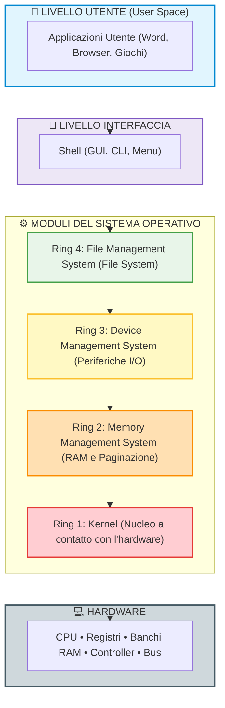
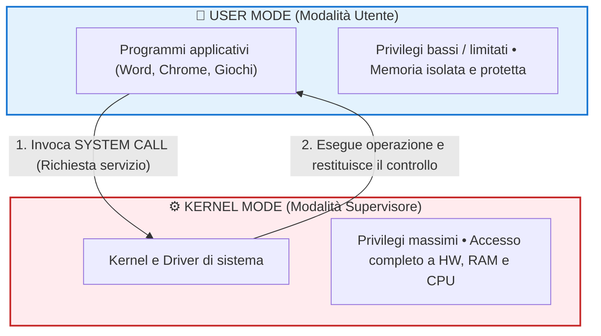
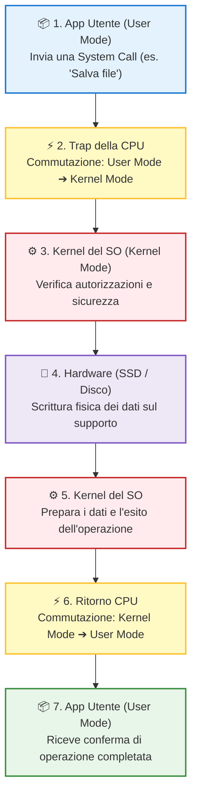

## 1. Il Modello a Ring (Architettura a "Buccia di Cipolla")

Un sistema operativo moderno è un programma immenso e sofisticato. Per evitare che sia caotico ed esposto a errori critici, la sua struttura software è divisa in **moduli** organizzati in una serie di anelli concentrici nidificati, detti **Ring**.

Questo schema prende il nome di **modello a ring** o **modello a buccia di cipolla**:

---

## 2. Il Principio della Macchina Astratta a Livelli

In questo modello:
- **Ogni anello rappresenta una macchina astratta differente**, costituita dai moduli software di quell'anello più tutti gli anelli a esso interni, fino all'hardware.
- **Regola di comunicazione gerarchica**: I moduli di un anello esterno **non dialogano mai direttamente con l'hardware**, bensì possono richiamare **esclusivamente i moduli dell'anello immediatamente più interno**. Solo l'anello più interno (il Kernel) tocca fisicamente i circuiti della macchina!

> [!IMPORTANT] Regola di Comunicazione Gerarchica
> **Anello Esterno** ➔ comunica *solo con* ➔ **Anello Interno** ➔ ... ➔ **Hardware**  
> *(È rigorosamente vietato saltare livelli intermedi o accedere direttamente all'Hardware)*

> [!TIP] Il Grande Vantaggio della Modularità
> Poiché i sistemi operativi devono funzionare su configurazioni hardware diversissime (processori Intel, AMD, ARM, schede grafiche e dischi di decine di marche diverse), l'organizzazione modulare permette di **sostituire o aggiornare un solo componente** (ad esempio installando un nuovo **driver**) senza dover riscrivere tutto il sistema operativo!

---

## 3. I 4 Ring del Sistema Operativo in Dettaglio

Analizziamo i compiti specifici di ciascuno dei 4 anelli del sistema operativo (dal più interno al più esterno):

| Ring | Modulo del Sistema Operativo | Funzioni Principali e Responsabilità |
| :---: | :--- | :--- |
| **Ring 1** | **Kernel (Nucleo)** | È lo strato più vicino alla macchina fisica. Gestisce la CPU, scandisce l'avanzamento dei processi (scheduling), gestisce gli **interrupt** hardware/software e controlla il funzionamento base dei driver. |
| **Ring 2** | **Memory Management System** *(Gestione Memoria)* | Gestisce la memoria RAM: tiene traccia in ogni istante di quali aree sono libere e quali occupate; **traduce l'indirizzo logico** del programma in **indirizzo fisico** reale; alloca e rilascia la memoria al termine dei processi. |
| **Ring 3** | **Device Management System** *(Gestione Periferiche)* | Gestisce la comunicazione con le periferiche (tastiera, mouse, monitor, stampante, schede); controlla il flusso di dati e segnali di I/O; assegna l'accesso ai dispositivi ed evita che due programmi vadano in conflitto. |
| **Ring 4** | **File Management System** *(comunemente **File System**)* | Gestisce l'organizzazione logica dei dati salvati sulla memoria secondaria (SSD, HDD, USB) sotto forma di **file e cartelle**; gestisce creazione, lettura, scrittura, cancellazione e backup dei file, astraendo la posizione fisica dei settori su disco. |

Oltre questi 4 anelli risiedono la **Shell** (l'interprete comandi / interfaccia grafica) e infine l'**Utente** con le sue applicazioni.

---

## 4. User Mode vs Kernel Mode

Per motivi di **sicurezza**, **stabilità** e **affidabilità**, la CPU del computer e il sistema operativo lavorano alternandosi tra due distinte modalità di esecuzione:

### Confronto Diretto tra le Due Modalità

| Proprietà | User Mode (Modalità Utente) | Kernel Mode (Modalità Supervisore) |
| :--- | :--- | :--- |
| **Chi la usa?** | I programmi applicativi dell'utente (Word, Browser, player video). | Il Kernel del sistema operativo e i driver essenziali. |
| **Livello di Privilegi** | **Basso / Limitato**. | **Massimo / Totale**. |
| **Accesso all'Hardware** | **Vietato**: non può accedere direttamente a porte I/O, dischi o schede. | **Completo e Diretto** a tutte le periferiche e componenti. |
| **Accesso alla Memoria** | Può leggere/scrivere **solo nella propria area di memoria privata**. | Può accedere a **tutta la memoria fisica** del sistema. |
| **Istruzioni CPU** | Solo istruzioni standard non pericolose. | Tutte le istruzioni, comprese quelle privilegiate di gestione CPU. |
| **Cosa succede in caso di Crash?** | Si chiude solo l'applicazione con un messaggio di errore (il resto del PC continua a funzionare). | **Crash totale del sistema** (la classica "Schermata Blu" o Kernel Panic). |

> [!WARNING] Perché non eseguire tutto in Kernel Mode?
> Se un semplice browser web o un programma scritto male girasse in Kernel Mode, un banale bug (o un virus) potrebbe sovrascrivere la memoria di altri programmi o distruggere file del sistema operativo, facendo **crollare l'intero computer**! 
> Mantenere le applicazioni confinate in User Mode garantisce che un crash di un programma non comprometta la sicurezza e la stabilità degli altri processi.

> [!NOTE] Comportamento della CPU in Kernel Mode
> Quando la CPU opera in **kernel mode**, esegue operazioni critiche che **non possono essere interrotte o terminate** a piacere dai normali processi, assicurando che le risorse condivise non rimangano in uno stato corrotto o inconsistente.

---

## 5. Il Ponte tra i Due Mondi: Le System Call

Se un'applicazione in *User Mode* non può toccare l'hardware, **come fa a salvare un file sul disco o a inviare un messaggio tramite Wi-Fi?**

Lo fa per mezzo delle **System Call** (chiamate al sistema operativo)!

> [!IMPORTANT] Definizione di System Call
> Una **System Call** è un'istruzione speciale con cui un programma applicativo (in *User Mode*) chiede al sistema operativo di eseguire un'operazione privilegiata per suo conto.

### Sequenza tipica di una System Call:

1. **Richiesta**: L'applicazione chiama una funzione di sistema (es. salvare un file).
2. **Commutazione (Trap)**: La CPU rileva la System Call, interrompe l'User Mode e **commuta in Kernel Mode**.
3. **Controllo ed Esecuzione**: Il Kernel verifica se l'operazione è lecita e sicura; se sì, attiva l'hardware (Ring 1) ed effettua l'operazione.
4. **Ripristino**: Il Kernel restituisce il risultato, la CPU **torna in User Mode** e il programma riprende la sua normale esecuzione.

